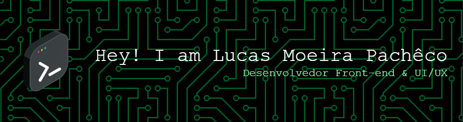

# 👋 Olá! Eu sou Lucas Moreira Pacheco

> **Desenvolvedor Front-End em Formação | Estudante de Sistemas de Informação**

---

## 🎯 Sobre Mim

Sou estudante de **Sistemas de Informação** na **UNEX - Faculdade de Excelência**, apaixonado por tecnologia e desenvolvimento de software. Busco constantemente novos desafios e oportunidades para aplicar meus conhecimentos em projetos inovadores.

**🔍 Objetivo Atual:** Estágio em Desenvolvimento de Software para crescimento profissional e aplicação prática dos conhecimentos adquiridos.

---

## 🏆 Projetos em Destaque

### 🛡️ **Projeto VIVA - Segurança da Mulher** | 2024
- Participação no desenvolvimento de aplicativo móvel para proteção feminina
- Aplicação de metodologia **Agile** para gestão do projeto
- Colaboração em equipe multidisciplinar focada em segurança

### 🏠 **Cortina Inteligente - IoT**
- Sistema de automação residencial com **Arduino**
- Integração entre hardware e software para controle inteligente
- Foco em sustentabilidade e eficiência energética

### ⚽ **Guru do Brasileirão**
- Aplicação web desenvolvida em **Técnicas de Desenvolvimento Web**
- Interface responsiva e experiência de usuário otimizada
- Integração com APIs para dados esportivos em tempo real

### 💰 **Aplicativo de Gestão Financeira Pessoal**
- Desenvolvimento utilizando **Metodologia Scrum**
- Interface intuitiva para controle de finanças pessoais
- Funcionalidades de categorização e relatórios

---

## 🎓 Formação Acadêmica

**🎓 Bacharelado em Sistemas de Informação** *(Em andamento)*  
**UNEX - Faculdade de Excelência**

**📚 Educação Complementar:**
- Bootcamps de Desenvolvimento Web - Digital Innovation One (DIO)
- Bootcamps de Segurança da Informação - Digital Innovation One (DIO)

---

## 🏅 Certificações Relevantes

✅ **Princípios de Desenvolvimento de Aplicações** - DIO  
✅ **Versionamento com Git e GitHub** - DIO  
✅ **Fundamentos do Desenvolvimento Web** - DIO  
✅ **Introdução ao Mikrotik** - Networking  
✅ **Monitoramento com ZABBIX Server** - Infraestrutura  
✅ **Metodologia Scrum** - Gestão de Projetos Ágeis  

---

## 🚀 Stack Tecnológica

[](https://github.com/lucaslmp2)

### 💻 Linguagens & Tecnologias


### 🗃️ Bancos de Dados


### 🛠️ Ferramentas & Sistemas


### 🖥️ Sistemas Operacionais


---

## 📈 GitHub Stats


---

## 🌟 Sobre Mim

```javascript
const lucas = {
    pronouns: "ele/dele",
    code: ["JavaScript", "TypeScript", "Python", "Java", "C", "HTML", "CSS"],
    askMeAbout: ["web dev", "tech", "cybersecurity", "networking"],
    technologies: {
        frontEnd: ["HTML", "CSS", "JavaScript", "TypeScript"],
        backEnd: ["Python", "Java"],
        databases: ["MySQL", "SQLite"],
        tools: ["Git", "Figma", "VS Code", "Postman"],
        misc: ["Arduino", "IoT", "Agile", "Scrum"]
    },
    currentFocus: "Buscando oportunidades de estágio em desenvolvimento",
    funFact: "Programo melhor ouvindo música lo-fi 🎵"
};
```

### 🎯 Interesses Pessoais
- 🔥 Entusiasta de tecnologia desde a infância
- 🎶 Lo-fi music para sessions de coding
- 📚 Sempre aprendendo algo novo
- 🛡️ Apaixonado por cybersecurity
- 🌐 Interessado em redes e protocolos

---

## 📫 Vamos Conversar?

Estou sempre aberto para discutir projetos interessantes, oportunidades de colaboração ou apenas trocar uma ideia sobre tecnologia!

[](https://www.linkedin.com/in/lucas-moreira-pacheco-32537620b/)
[](mailto:lucaspachecolp2@gmail.com)
[](https://wa.me/5573988716897)
[](https://www.instagram.com/lucasmoreirapacheco_/)
[](https://github.com/lucaslmp2)

---

<div align="center">
  
### 💭 *"O código é poesia em movimento, cada linha uma história para contar"*


⭐️ **Se você gostou de algum dos meus repositórios, deixe uma estrela!** ⭐️

</div>
